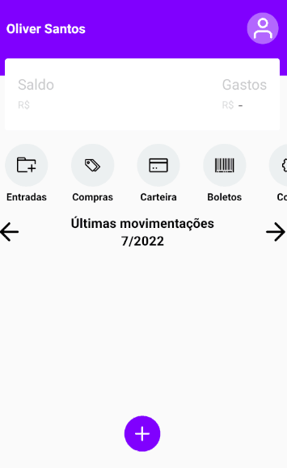
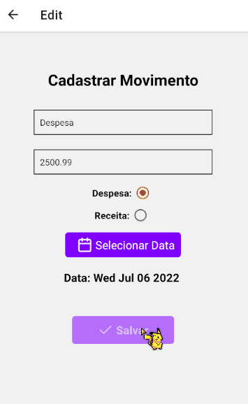
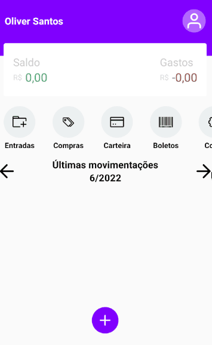

<h1 align="center">React-Native Despesas</h1>

Essa é uma aplicação que está sendo desenvolvida para uso pessoal e aprendizagem do framework React-Native

 <a href="#características">Características</a> •
 <a href="#tecnologias">Tecnologias</a> •
 <a href="#instalação">Instalação</a> •
 <a href="#aplicação">Download</a>

### Características

  <h1 align="center">Cadastro de Receita</h1>
  

  <h1 align="center">Cadastro de Despesa</h1>
  

  <h1 align="center">Reload</h1>
  

  <h1 align="center">Paginação</h1>
  

### Tecnologias

As seguintes ferramentas foram usadas na construção do projeto:

- [Node](https://nodejs.org/en/)
- [React Native](https://reactnative.dev/)
- [Typescript](https://www.typescriptlang.org/)
- [Yarn](https://www.npmjs.com/package/yarn)
- [Expo](https://expo.dev/)

### Instalação

Para executar o projeto em sua maquina é necessário instalação do [yarn](https://www.npmjs.com/package/yarn) e do [Expo](https://www.npmjs.com/package/expo)

comando: npm i yarn
 
comando: npm i expo

Após instalação do expo rode os comandos respectivamente em sua maquina:

comando 1: yarn i
 
comando 2: expo start

### Aplicação
 
link para download: https://expo.dev/accounts/oliver_rx/projects/despesasRN/builds/00e321f0-3f84-488b-a57b-fac43ca3e1eb
